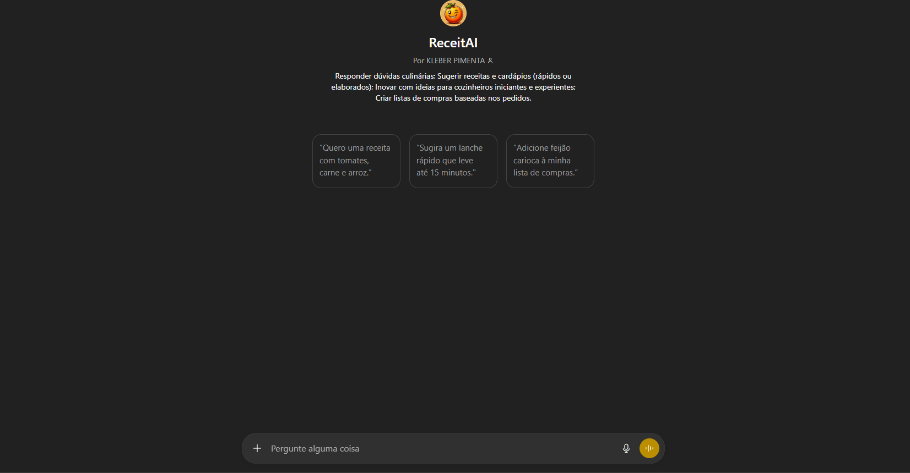

# ReceitAI — Agente de Inteligência Artificial

Projeto acadêmico desenvolvido no **1º período de Engenharia da Computação** como primeiro contato prático com Inteligência Artificial.

##  Sobre o projeto

O ReceitAI é um agente de IA configurado para sugerir receitas a partir dos ingredientes informados pelo usuário.  
O agente foi estruturado para manter respostas restritas ao contexto culinário, evitando assuntos fora do escopo definido.

O objetivo do trabalho era que cada grupo desenvolvesse um agente capaz de resolver um problema do cotidiano utilizando IA conversacional.

Hoje, já no **3º período**, revisito este projeto como marco inicial do meu aprendizado em IA aplicada e engenharia de prompts.

---

##  Acessar o agente

👉 [Abrir ReceitAI](https://chatgpt.com/g/g-681a4e6d2f348191905d093f007fc2c2-receitai)

---

##  Conceitos aplicados

- Inteligência Artificial Conversacional
- Engenharia de Prompts
- Definição de regras de comportamento
- Estruturação de agentes

---

##  Equipe do projeto

- Allan Patrick Fantoni Filho  
- Alex Augusto Franco Rosa  
- Artur Pimenta  
- Rafael Giacomin Reali
